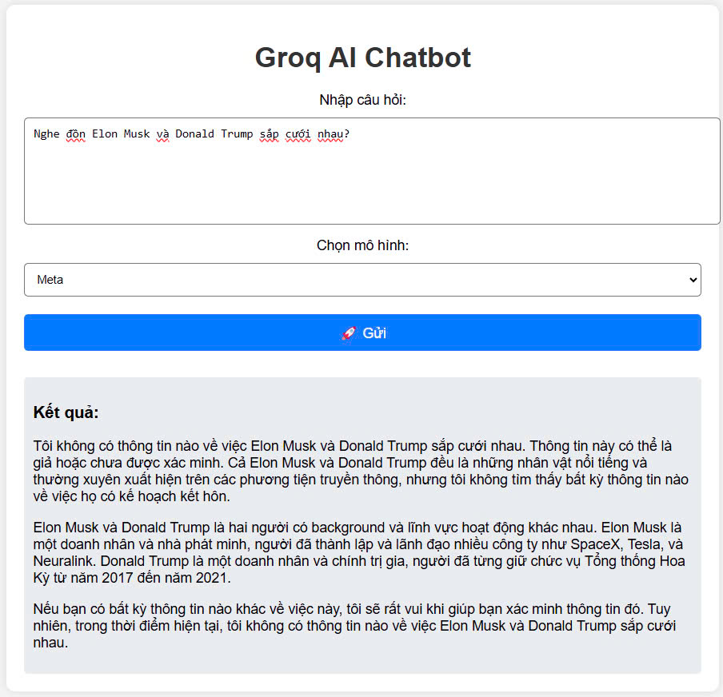

# Câu 1: Đề thi thực tập sinh Golang tại Techmaster

## 📂 Cấu Trúc Dự Án
```
01/
│── .env                # Cấu hình biến môi trường (groq api key)
│── go.mod              # Quản lý module Go
│── go.sum              # Danh sách dependencies
│── main.go             # Tệp nguồn chính
│── README.md           # Hướng dẫn sử dụng
│── static/             # Chứa tài nguyên tĩnh (CSS, JS, hình ảnh)
│── templates/          # Chứa các tệp HTML template
```
## Lấy API Key từ Groq  
Nếu API key hiện tại không còn hoạt động, hãy làm theo các bước sau để tạo một **Groq API Key** mới:  

- Truy cập **[Groq](https://groq.com/)**.  
- Điều hướng đến **Developers** > **Free API Key**, bạn sẽ được chuyển hướng đến **GroqCloud**.  
- Chọn tab **API KEYS**, sau đó nhấn **Create API Key**.  
- Nhập một tên bất kỳ cho API Key và nhấn **Submit**.  
- Sao chép **API Key** được cung cấp và dán vào tệp `.env` của dự án.  

## Cài Đặt & Chạy Dự Án

### 1️. Clone Repository
```bash
git clone https://github.com/congmanh18/Intern-Test-Techmaster.git .
cd 01
```

### 2️. Cấu Hình Biến Môi Trường
Tạo file `.env` và cập nhật nội dung phù hợp.
```bash
touch .env
```

### 3️. Cài Đặt Dependencies
```bash
go mod tidy
```

### 4️. Chạy Dự Án
```bash
go run main.go
```
Dự án sẽ chạy tại `http://localhost:8080`

## 📌 Kết quả
Sau khi triển khai thành công, ứng dụng sẽ cung cấp giao diện tương tác và API hoạt động như sau:

