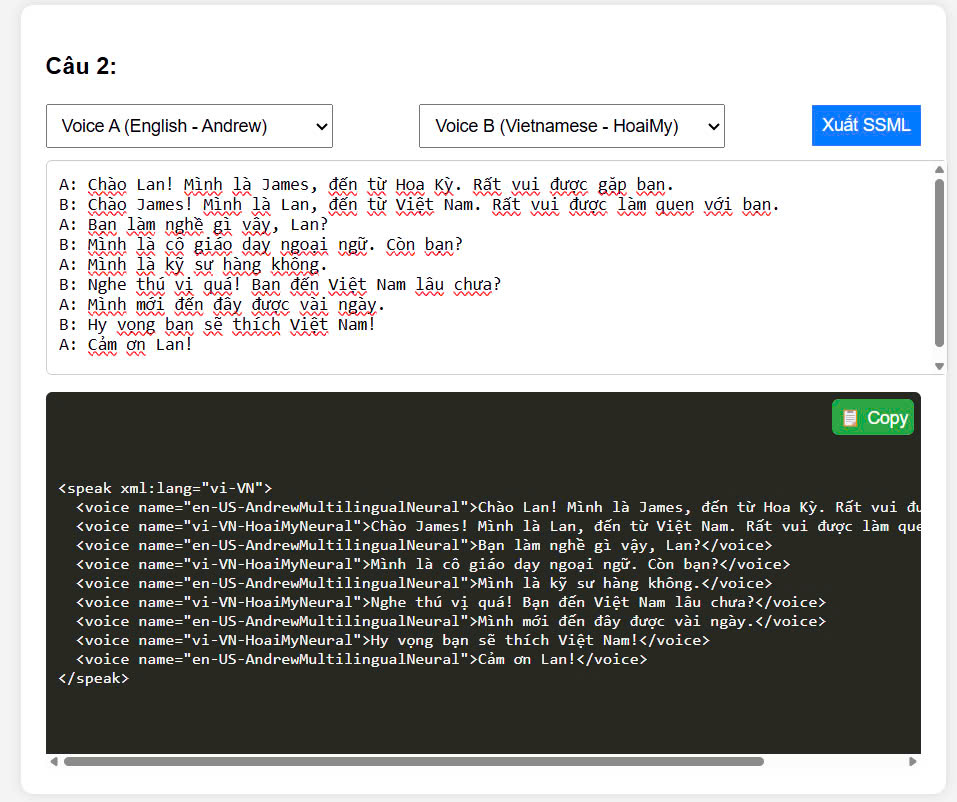

# Câu 2: Đề thi thực tập sinh Golang tại Techmaster

### 1️. **Chạy ứng dụng**  
Mở file **index.html** trong trình duyệt web hoặc triển khai trên server tĩnh.  

### 2️. **Nhập hội thoại**  
Ví dụ hội thoại mẫu:  
```
A: Chào Lan! Mình là James, đến từ Hoa Kỳ. Rất vui được gặp bạn.  
B: Chào James! Mình là Lan, đến từ Việt Nam. Rất vui được làm quen với bạn.  
A: Bạn làm nghề gì vậy, Lan?  
B: Mình là cô giáo dạy ngoại ngữ. Còn bạn?  
```

### 3️. **Chọn giọng đọc**  
- **Voice A**: Chọn giọng đọc Tiếng Anh (Andrew, Christopher, Eric).  
- **Voice B**: Chọn giọng đọc Tiếng Việt (Hoài My, Nam Minh).  

### 4️. **Xuất SSML**  
Nhấn **"Xuất SSML"**, hệ thống sẽ chuyển hội thoại thành đoạn mã SSML như sau:  
```xml
<speak xml:lang="vi-VN">
  <voice name="en-US-AndrewMultilingualNeural">Chào Lan! Mình là James, đến từ Hoa Kỳ. Rất vui được gặp bạn.</voice>
  <voice name="vi-VN-HoaiMyNeural">Chào James! Mình là Lan, đến từ Việt Nam. Rất vui được làm quen với bạn.</voice>
</speak>
```

### 5️. **Copy và sử dụng SSML**  
Nhấn nút 📋 **Copy** để sao chép đoạn mã SSML và sử dụng trong các hệ thống **Text-to-Speech** như Google Cloud TTS, Amazon Polly hoặc Azure Speech.  

---



