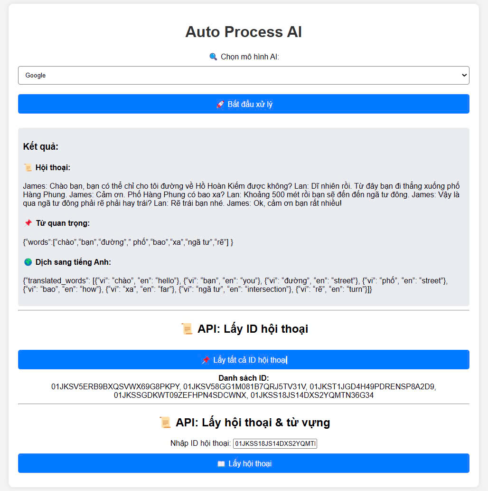
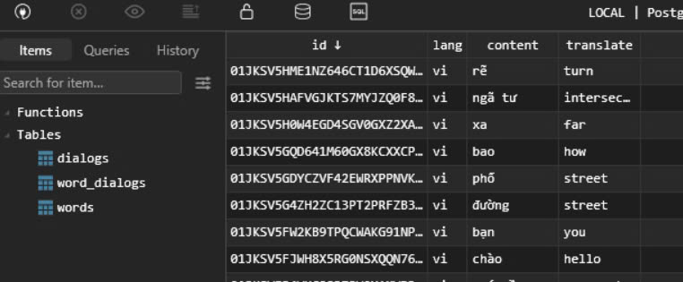

# Câu 3: Đề thi thực tập sinh Golang tại Techmaster

## Mục Lục
1. [Giới thiệu](#giới-thiệu)
2. [Kiến trúc thư mục](#kiến-trúc-thư-mục)
3. [Yêu cầu hệ thống](#yêu-cầu-hệ-thống)
4. [Cài đặt và khởi chạy dự án](#cài-đặt-và-khởi-chạy-dự-án)
    - [Bước 1: Clone repository](#bước-1-clone-repository)
    - [Bước 2: Thiết lập PostgreSQL bằng Docker](#bước-2-thiết-lập-postgresql-bằng-docker)
    - [Bước 3: Cấu hình biến môi trường](#bước-3-cấu-hình-biến-môi-trường)
    - [Bước 4: Chạy ứng dụng](#bước-4-chạy-ứng-dụng)
5. [Hướng dẫn theo hệ điều hành](#hướng-dẫn-theo-hệ-điều-hành)
6. [Nhận xét và kết luận](#nhận-xét-và-kết-luận)
7. [Kết quả](#kết-quả)

---

## 📂 Cấu trúc thư mục
Dự án được tổ chức với cấu trúc sau:

```
03/
│── cmd/             # Chứa entry point của ứng dụng
│── handler/         # Chứa các xử lý logic HTTP
│── images/          # Chứa các hình ảnh kết quả và đề thi
│── migrate/         # Chứa các tệp di trú cơ sở dữ liệu
│── model/           # Định nghĩa cấu trúc dữ liệu
│── provider/        # Cấu hình nhà cung cấp dịch vụ
│── repository/      # Lớp truy xuất dữ liệu
│── server/          # Khởi tạo máy chủ HTTP
│── static/          # Chứa các tệp tĩnh
│── templates/       # Chứa các tệp mẫu giao diện
│── utils/           # Chứa các tiện ích chung
│── go.mod           # Tệp quản lý module Go
│── go.sum           # Danh sách các phụ thuộc
│── local.env        # Tệp cấu hình biến môi trường
│── README.md        # Hướng dẫn sử dụng
```

---

## Yêu cầu hệ thống
Trước khi bắt đầu, hãy đảm bảo bạn đã cài đặt các công cụ sau trên hệ thống của mình:

- **Visual Studio Code (VSCode)**
- **Golang**
- **Git Bash**
- **Docker Desktop**

Hướng dẫn này áp dụng cho cả **Windows**, **Linux** và **macOS**.

---

## Cài đặt và khởi chạy dự án

### Bước 1: Clone repository
Mở terminal và chạy lệnh:
```bash
git clone https://github.com/congmanh18/Intern-Test-Techmaster.git .
```

### Bước 2: Thiết lập PostgreSQL bằng Docker
1. **Khởi động Docker Desktop** trên máy tính.
2. Tạo container PostgreSQL lần đầu:
   ```bash
   docker run --name postgres-17 -p 5432:5432 -e POSTGRES_USER=cmn -e POSTGRES_PASSWORD=localpassword -e POSTGRES_DB=cmnexpress -d postgres:latest
   ```
3. Bắt đầu container khi sử dụng lại:
   ```bash
   docker start postgres-17
   ```
4. Dừng container:
   ```bash
   docker stop postgres-17
   ```
5. Xóa container:
   ```bash
   docker rm postgres-17
   ```
6. Xóa image PostgreSQL:
   ```bash
   docker rmi postgres:latest
   ```

### Bước 3: Cấu hình biến môi trường
Di chuyển vào thư mục `03` và tạo tệp `local.env`:
```bash
cd 03
```

Nội dung của `local.env`:
```env
GROQ_API_KEY=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
GROQ_URL=https://api.groq.com/openai/v1/chat/completions

ENABLE_MIGRATION=true

POSTGRES_HOST=localhost
POSTGRES_PORT=5432
POSTGRES_USER=cmn
POSTGRES_PASSWORD=localpassword
POSTGRES_DB=cmnexpress
```

### Bước 4: Chạy ứng dụng
Chạy lệnh sau để khởi động ứng dụng:
```bash
go run ./cmd/main.go -config="./local.env"
```
Truy cập `localhost:8080` để trải nghiệm ứng dụng

```bash
http://localhost:8080/
```

---

## Hướng dẫn theo hệ điều hành

### Windows
- Sử dụng **Git Bash** hoặc **PowerShell** để chạy các lệnh Docker và Git.
- Đảm bảo **Docker Desktop** đã chạy trước khi khởi động container PostgreSQL.

### Linux
- Cài đặt Docker qua package manager (`apt`, `yum`, `dnf`).
- Nếu chưa cấu hình quyền truy cập Docker cho user không phải root, hãy sử dụng `sudo` trước mỗi lệnh Docker.

### macOS
- Cài đặt **Docker Desktop** cho macOS và đảm bảo nó đang chạy.
- Dùng terminal mặc định hoặc shell tùy thích để chạy lệnh.

---

## Nhận xét và Kết luận
Dự án này giúp thực tập sinh Golang làm quen với việc:
- Thiết lập môi trường phát triển backend với Golang.
- Làm việc với cơ sở dữ liệu PostgreSQL.
- Sử dụng Docker để quản lý dịch vụ.
- Quản lý cấu hình ứng dụng bằng biến môi trường.

## 📌 Kết quả

Sau khi triển khai thành công, ứng dụng sẽ cung cấp giao diện tương tác và API hoạt động như sau:

### **Tạo hội thoại tự động**
Khi người dùng khởi động quá trình xử lý, API sẽ sử dụng mô hình AI để tạo ra hội thoại mẫu, dựa trên đề bài. Dữ liệu này được lưu trữ trong hệ thống và có thể được truy xuất lại bất cứ lúc nào.



---

### **Lưu trữ dữ liệu vào cơ sở dữ liệu**
Tất cả hội thoại được sinh ra sẽ được lưu trữ trong PostgreSQL, giúp dễ dàng truy xuất và quản lý.



---

### **Truy xuất dữ liệu từ cơ sở dữ liệu**
Ứng dụng hỗ trợ API để truy xuất hội thoại đã lưu từ database. Điều này giúp dễ dàng kiểm tra, đánh giá và tiếp tục xử lý nội dung.


---
### 📺 **Video Demo YouTube**
## 🔗 **Xem Ngay**: [](https://youtu.be/rUVLZx3DSCw?si=oc1B_t-wG3pGp6Jx)  
🔗 **Link video**: [https://youtu.be/rUVLZx3DSCw?si=oc1B_t-wG3pGp6Jx](https://youtu.be/rUVLZx3DSCw?si=oc1B_t-wG3pGp6Jx)  

---

